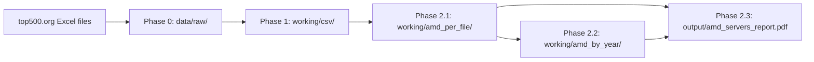

# TOP500 AMD Analysis Pipeline

Phased scripts for converting TOP500 list files and analyzing AMD-based servers.
Intermediate results are cached under `working/` so you can re-run later phases without
repeating earlier work.

## Architecture

The pipeline runs in four ordered phases. Each phase reads from the previous phase's
output folder and writes to its own working or output directory.



| Phase | Command | What it does |
|-------|---------|--------------|
| 0 | `phase0` | Clear `data/raw/` and `working/`, then download TOP500 or Green500 Excel files from [top500.org](https://www.top500.org/lists/top500/) (Green500 uses `/files/green500/green500_top_YYYYMM.xlsx`). Use `--skip-clean` to keep existing files. |
| 1 | `phase1` | Convert raw TOP500 files to normalized CSV |
| 2.1 | `phase2-1` | Filter servers with Processor Generation containing AMD; dedupe by System ID |
| 2.2 | `phase2-2` | Keep AMD servers with build years in the last 6 years where data is present |
| 2.3 | `phase2-3` | Build PDF report with charts |
| 2 (all) | `run-phase2` | Run phases 2.1–2.3 using existing `working/csv/` files |
| all | `run-all` | Run phases 1–2.3 only (`phase0` download is separate; use `--skip-phase1` to omit conversion) |

Each phase **skips work** when its output files are newer than their inputs. Pass
`--force` on any command to rebuild that phase regardless of timestamps.

Standalone script wrappers live in `scripts/` if you prefer running phases as individual
files rather than through the CLI module.

### Folder layout

| Path | Purpose |
|------|---------|
| `data/raw/` | Phase 0: downloaded TOP500/Green500 Excel files |
| `working/csv/` | Phase 1: normalized CSV conversions |
| `working/amd_per_file/` | Phase 2.1: Processor Generation AMD servers per source file |
| `working/amd_by_year/` | Phase 2.2: AMD servers for recent build years (up to 6 years with data) |
| `output/` | Phase 2.3: PDF report with charts |

### Key modules

| Module | Role |
|--------|------|
| `src/top500list/phase0_download.py` | Clean pipeline folders, download list Excel files from top500.org |
| `src/top500list/amd_filter.py` | AMD detection, Processor Generation filter, build-year filtering |
| `src/top500list/amd_cohort.py` | Dedupe, per-edition counts, transitions, interconnect/accelerator cohorts |
| `src/top500list/phase3_pdf_report.py` | Chart and PDF generation |
| `src/top500list/cli.py` | Click CLI entry point for all phases |

## Quick start

### Linux

Requires Python 3.11 or newer.

```bash
git clone https://github.com/tdmakepeace/Top500_AMD_data.git
cd Top500_AMD_data

python3 -m venv .venv
source .venv/bin/activate

pip install --upgrade pip
pip install -r requirements.txt
```

Download list files from [top500.org](https://www.top500.org/lists/top500/), or copy your own
`.xlsx` / `.csv` files into `data/raw/`, then run:

```bash
# Download the last 4 years of TOP500 lists (prompts for list type and years).
# By default, clears data/raw/ and all working/ subfolders before downloading.
python -m top500list.cli phase0

# Non-interactive example: TOP500, 4 years
python -m top500list.cli phase0 --list-type TOP500 --years 4

# Run the full analysis pipeline (phases 1–2.3; run phase0 separately first)
python -m top500list.cli run-all
```

For development dependencies (pytest, ruff), use `uv pip install -e ".[dev]"` or add
`pytest`, `pytest-cov`, and `ruff` to your environment manually.

### Windows

```powershell
cd "c:\Users\tmakepea\OneDrive - Advanced Micro Devices Inc\Documents\Cursor Projects\Top500list"
uv venv
.\.venv\Scripts\Activate.ps1
uv pip install --system-certs -e ".[dev]"
```

> On corporate networks, `uv pip install` may need `--system-certs` for TLS.

Download list files from [top500.org](https://www.top500.org/lists/top500/), or copy your own
`.xlsx` / `.csv` files into `data/raw/`, then run:

```powershell
# Download the last 4 years of TOP500 lists (prompts for list type and years).
# By default, clears data/raw/ and all working/ subfolders before downloading.
python -m top500list.cli phase0

# Non-interactive example: TOP500, 4 years
python -m top500list.cli phase0 --list-type TOP500 --years 4

# Non-interactive example: GREEN500, 4 years
python -m top500list.cli phase0 --list-type GREEN500 --years 4

# Keep existing raw and working files; only download missing editions
python -m top500list.cli phase0 --list-type TOP500 --years 4 --skip-clean

# Re-download everything after a clean start
python -m top500list.cli phase0 --list-type TOP500 --years 4 --force

# Run phases individually
python -m top500list.cli phase1
python -m top500list.cli phase2-1
python -m top500list.cli phase2-2
python -m top500list.cli phase2-3

# Run analysis phases only (does not download from top500.org; run phase0 separately)
python -m top500list.cli run-all

# CSVs already converted? Run phase 2 only
python -m top500list.cli run-phase2

# Or skip phase 1 when using run-all
python -m top500list.cli run-all --skip-phase1
```

Equivalent standalone scripts:

```powershell
python scripts/phase0_download_lists.py
python scripts/phase1_convert_to_csv.py
python scripts/phase2_1_amd_per_file.py
python scripts/phase2_2_amd_by_build_year.py
python scripts/phase2_3_build_pdf.py
python scripts/run_phase2.py
```

### Phase 0 options

| Flag | Default | Purpose |
|------|---------|---------|
| `--list-type` | prompt | Which list to download (`TOP500` or `GREEN500`) |
| `--years N` | `4` | Calendar years to fetch (current year plus prior years); June and November editions per year |
| `--skip-clean` | off | Keep existing files in `data/raw/` and `working/` instead of clearing them first |
| `--force` | off | Re-download files even when they already exist in `data/raw/` |
| `--raw-dir` | `data/raw/` | Override download destination |

By default, `phase0` removes all files in `data/raw/`, `working/csv/`, `working/amd_per_file/`,
and `working/amd_by_year/` (`.gitkeep` files are preserved). Use `--skip-clean` when you only
want to add editions without wiping converted CSVs or AMD tables. If cleanup fails because a
file is open in Excel or locked by OneDrive, close the file or use `--skip-clean`.

## Outputs

- `data/raw/TOP500_YYYYMM.xlsx` or `green500_top_YYYYMM.xlsx` — downloaded list editions (June `06`, November `11`)
- `working/amd_per_file/*_amd.csv` — Processor Generation AMD systems per list file (deduped)
- `working/amd_per_file/amd_per_file_manifest.csv` — per-file server counts (used in charts)
- `working/amd_by_year/amd_servers_by_build_year.csv` — unique AMD servers from the latest list edition
- `working/amd_by_year/amd_build_year_counts_by_edition.csv` — unique counts per build year per list file
- `working/amd_by_year/amd_build_year_transitions.csv` — added/dropped servers between consecutive list files
- `output/amd_servers_report.pdf` — 8-page report (see below)

### Cohort definitions

Most charts use **Processor Generation: AMD** as the primary AMD server definition. Servers are
deduplicated by `System ID` (fallback: Name + Site ID). Intel CPU hosts with AMD Instinct
accelerators are excluded from this cohort but may appear in GPU-specific charts.

| Chart / output | Cohort |
|----------------|--------|
| AMD servers per list file (page 1) | Processor Generation AMD, all build years |
| Build-year charts (pages 1–3) | Processor Generation AMD, up to 6 build years with data (`BUILD_YEAR_SPAN = 6`) |
| Instinct / MI GPU charts (page 2) | Full list files; matches Instinct/MI in accelerator, processor, etc. |
| Interconnect list transition (page 4, top) | Processor Generation AMD, all build years |
| Interconnect + build year (page 4, bottom) | Processor Generation AMD, up to 6 build years with data |
| Accelerator vendor stacked bar (page 5) | Processor Generation AMD; vendor from `Accelerator/Co-Processor` only |
| Top systems tables (page 6) | Latest list edition; top 10 by Rank for Processor Technology AMD and Accelerator/Co-Processor AMD |
| Processor / GPU / manufacturer trends (page 7) | All systems across all list editions |
| Accelerator vendors all processors (page 8) | All systems; vendor from `Accelerator/Co-Processor` only |

### PDF report pages

1. **AMD CPU servers** — per-file counts, build-year breakdown, edition trends
2. **AMD Instinct / MI GPU** — per-file GPU system counts and build-year trends
3. **Countries** — top 10 countries, country trends, build-year transition inventory
4. **Interconnect** — interconnect family across editions; build year + interconnect combos
5. **Accelerator vendors** — stacked bar per list file (NVIDIA, AMD, Intel, none, other)
6. **Top systems** — two tables from the latest list edition (top 10 by Rank):
   - Processor Technology AMD (`Processor Technology` when present, else `Processor Generation`)
   - Accelerator/Co-Processor AMD (AMD Instinct / MI in the accelerator field)
   - Columns: Rank, Name, Manufacturer, Country, Year, Processor, Accelerator/Co-Processor
7. **Market trends (all systems)** — line charts across list editions:
   - CPU vendor from Processor Technology (AMD, Intel, NVIDIA, ARM, Other)
   - GPU vendor from Accelerator/Co-Processor (AMD, Intel, NVIDIA, Other)
   - Top 10 manufacturer groups (normalized names, e.g. ASUSTek, NVIDIA, HPE)
8. **Accelerator vendors (all processors)** — same stacked bar as page 5 for all systems (any CPU)

## Re-iteration workflow

The working folders exist so you can refine the pipeline without repeating expensive
steps. Typical iteration loops:

### Adding new source data

1. Run `phase0 --skip-clean` to pull additional editions without clearing `working/`, or run
   `phase0` for a full fresh download (clears `data/raw/` and `working/` first)
2. Run `phase1` — only new or changed files are converted
3. Run `phase2-1` through `phase2-3` — unchanged upstream files are skipped

### Tweaking AMD detection

1. Edit patterns in `src/top500list/amd_filter.py` (Processor Generation, GPU, accelerator vendor)
2. Re-run `phase2-1 --force` to rebuild per-file AMD tables
3. Re-run `phase2-2 --force` and `phase2-3 --force` to refresh downstream outputs

### Tweaking the build-year window

1. Re-run with an explicit anchor year, e.g. `phase2-2 --force --reference-year 2026`
2. Re-run `phase2-3 --force` to update the PDF charts

### Tweaking charts or report layout

1. Edit `src/top500list/phase3_pdf_report.py`
2. Re-run `phase2-3 --force` — phases 1 and 2.1/2.2 are untouched

### Full rebuild

```powershell
python -m top500list.cli run-all --force
```

## Tests

```powershell
pytest
```
